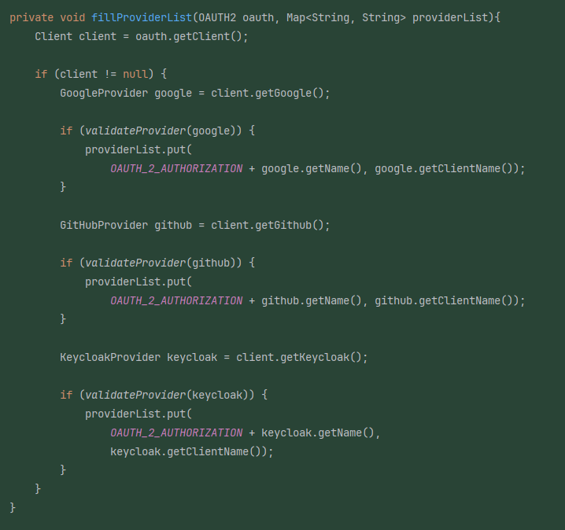
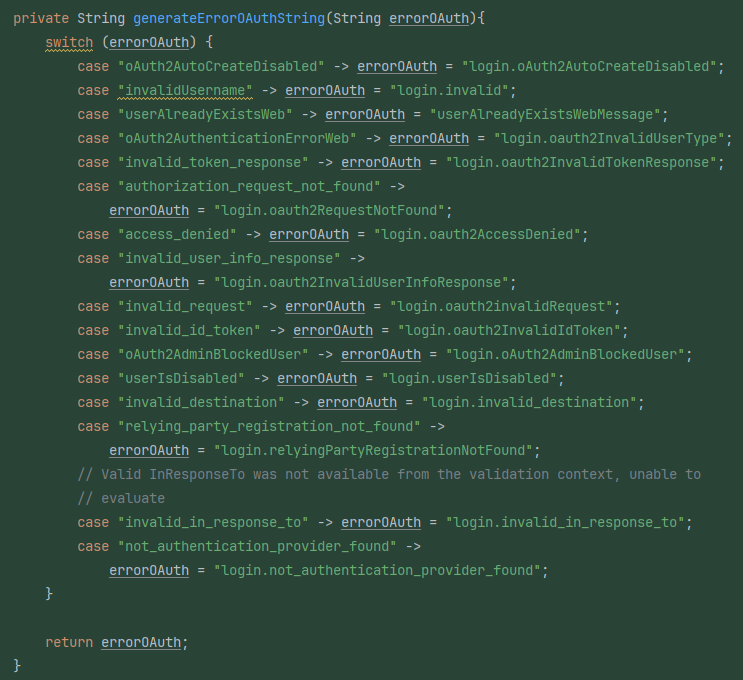

### Account WEb Controller

- "Brain Method" detected (login function)
  - Refactored function by creating two private functions containing parts of the original function
  - See the changes below:
  - 
  - 
