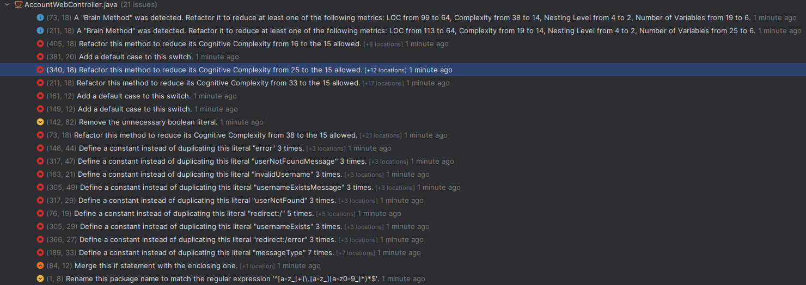

### Account Web Controller

- "Brain Method" detected (login function)
  - Refactored function by creating two private functions containing parts of the original function reducing the lines of code
  - See the changes below:
  - 
  - 

- "Brain Method" detected (showAddUserForm function)
  - Did the same as for the login function
  - See git history

- Add a default case to this switch
  - Added default setting element to null on default or error message
  - See an example below:
  - 
