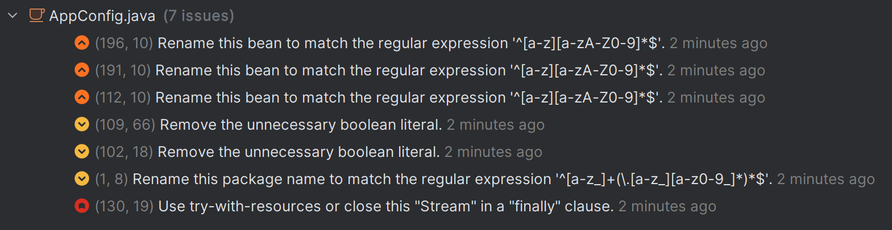
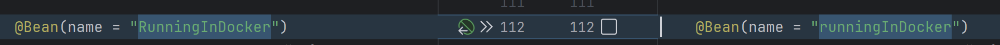
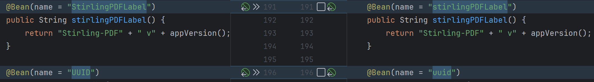
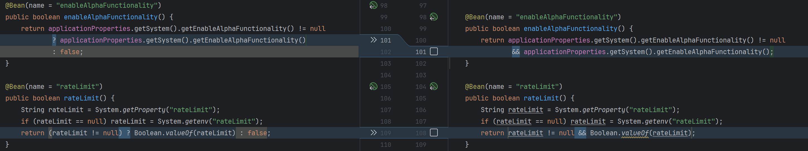
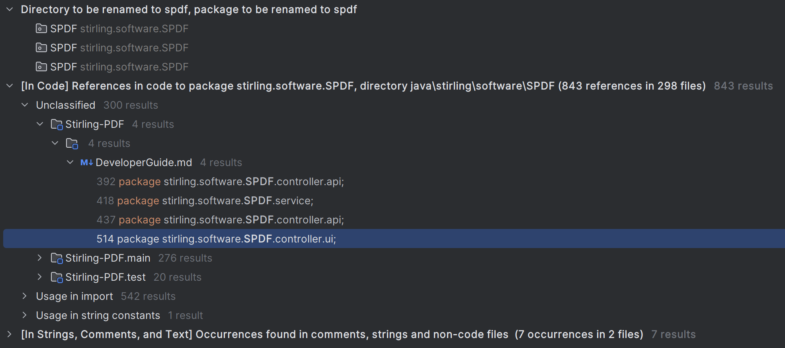
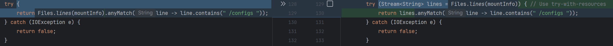

### App Config Sonar Qube Issue Analyses

#### Issue: Rename bean to match the regular expression

Fix: Rename the Beans to fit the naming scheme

#### Issue: Remove unnecessary boolean literal

Fix: Removed boolean literal and changed it to a comparison instead

#### Issue: Rename this package name to match a regular expression
Fix: Not fixed! This would require a change of all package names in each file of the project.
Such a change would be possible using IDEAs refactoring, but it might not be necessary and should be evaluated.
(Over 800 references would be changed. See image below.).

#### Issue: Use try-with-resources or close this "Steam" in a "finally" clause

Fix: Call the try block with the output from the file to prevent possible memory leaks.
