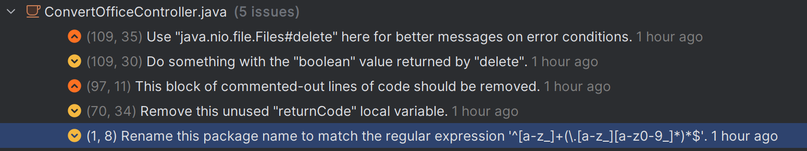
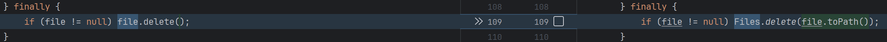
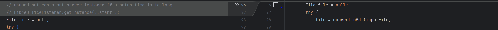
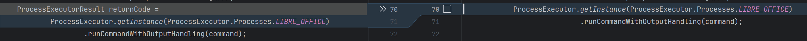

### Convert Office Controller Issue Analyses

#### Issue: Use "java.nio.file.Files#delete"

Fix: Use Nio's delete function to throw an exception if the file could not be removed. The earlier implementation
just returned False if the file could not be removed. Nio's delete is more descriptive.

#### Issue: Do something with the "boolean" value returned by "delete"
Fix: Fixed due to the change to Nio's delete

#### Issue: Block of commented-out lines of code should be removed

Fix: Deleted commented section. Changes can also be found in git history if needed.

#### Issue: Remove this unused "returnCode" local variable

Fix: Removed local variable as it was not used.

#### Issue: Rename this package
Did not fixed this. See AppConfigIssus.md -> Issue: Rename this package name to match a regular expression
